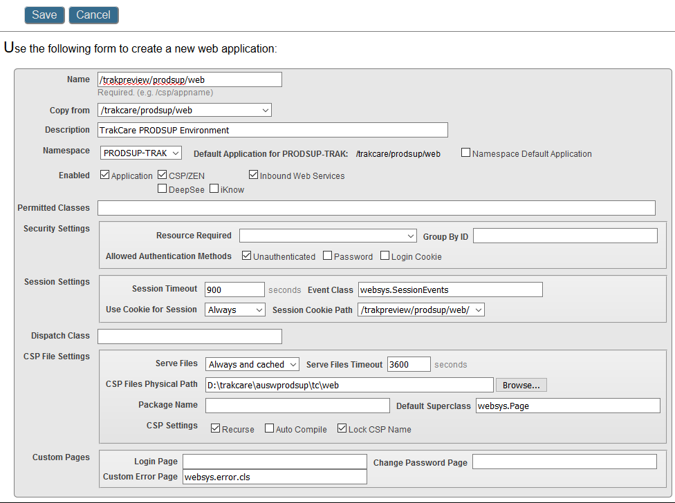
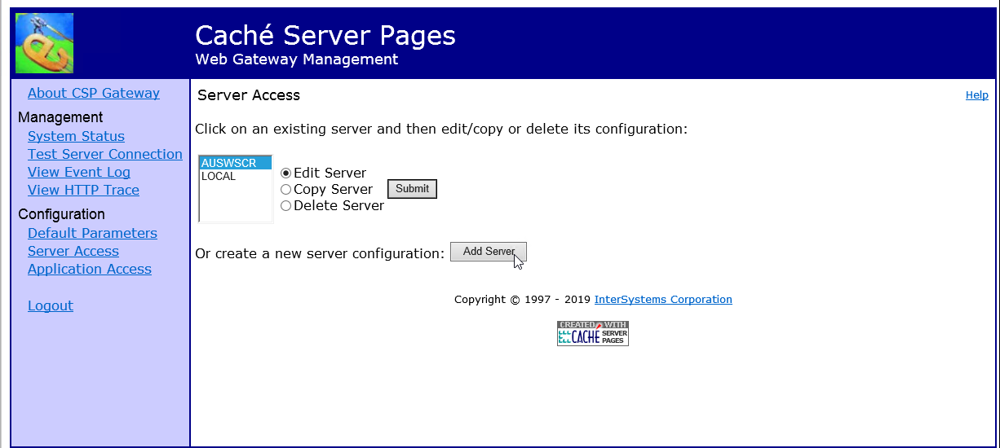

# Setup Trak Printing

> **{ENV}** = SCR2  
> **{INSTANCE}** = AUSWSCR2

1. Log into System Management Portal
2. Go to System Administration | Configuration | Connectivity | ECP Settings

 

3. Click on 'Data Servers'


4. Click on 'Add Server'


5. Fill in the Server Name, IP Address and IP Port. If you are creating a print server for a mirrored environment, check the 'Mirror Connection' box. Click on 'Save'


6. Open a terminal connection to the print server and change to the %SYS namespace
```
AUSWTESTPRT:USER>zn "%SYS"
    
AUSWTESTPRT:%SYS>
```
7. Run the ZBTC18AUXX routine to create the namespace and global mappings:
```
D ^ZBTC18AUXX
```
8. Enter the following answers at the prompts:

    ○ No  
    ○ D:\trakcare  
    ○ AUSW  
    ○ WIP  
    ○ T  
    ○ Yes  
```
AUSWTESTPRT:%SYS>D ^ZBTC18AUXX
    
Do you wish to configure the HSF Instance Parameters? (Y)es (N)o: No
HS Instance Parameters will not be configured.
Please enter the path to the TrakCare Install directory:
D:\trakcare
Please enter the site code (e.g. AUXX):
AUSW
Please enter the working environment (e.g. BASE,TEST,LIVE):
PRODSUP
Is this a TrakCare, Analytics or Analytics inside TrakCare instance environment? (T)rakCare (A)nalytics (I)ntegrated Analytics: T
TrakCare Environment will be built.
TrakCare root directory set to... D:\trakcare\
    
TrakCare site code set to... AUSW
    
TrakCare environment set to... PRODSUP
    
Install type set to... T
    
This is a TrakCare install!
Databases path set to... D:\trakcare\auswprodsup\tc\db
Web files path set to... D:\trakcare\auswprodsup\tc\web
Namespace set to... PRODSUP-TRAK
Do you wish to continue? (Y)es (N)o: Yes
```

9. RDP to the print server and open the cache.cpf file: I:\InterSystems\HealthShare\cache.cpf
10. Find the lines that begin with the namespace you have just created and replace ',,1' at the end of each line with ',AUSWPRODSUP' (AUSWPRODSUP is the ECP connection created in step 5). Do this for all except for the PRODSUP-LOCALENS.

From this:


To this:


11. Save the file and close. You will need to restart the HealthShare instance for the change to take effect.

12. On the print server, go to the data drive and remove all database folders except for 'localens'


13. In System Management Portal, go to System Administration | Security | Applications | Web Applications


14. Click 'Create New Web Application'


15. In the 'Name' box, type '/trakpreview/{ENV}/web'

16. In the 'Copy from' box, select '/trakcare/{ENV}/web' (The 'trakcare' application was created earlier by the build routine.). Click on 'Save'



17. The automatically created application is no longer required. It can be deleted: 


18. Open an RDP connection to the Trak server that you are setting up printing for, open Internet Explorer and go to  http://w0satrakappd04/csp/bin/Systems/Module.cxw

19. Enter the credentials for CSPSystem and click 'Login'


20. Click 'Server Access' on the menu, then click on the 'Add Server' button



21. Name the server {INSTANCENAME}PRT. Eg AUSWSCRPRT. Enter the IP address and port number of the print server. Add 'User Name' and password (Username = CSPSystem)


22. Leave the rest of the configuration items as default. Scroll to the bottom of the page and click on 'Save Configuration'

23. Configure 'Application Access' for /trakpreview/scr/web to use newly added server

24. Compile Report.Print.EnsemblePrintService production for namespace on print server

25. Run GrantAllSQLPrivileges() on print server in new namespace

26. Create 'temp' folder for zen print service. Eg: D:\trakcare\auswwip\tc\temp

27. To allow Zen reports to export larger amounts of data to Excel, we need to add another System Environment Variable to the print server - EXCELMEMSIZE = 1024m:


