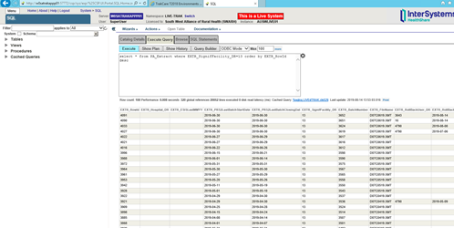
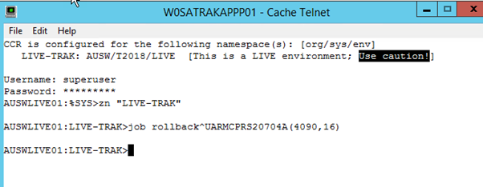
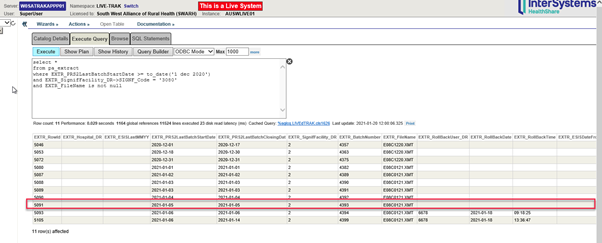

# View PRS2 Batch numbers and run manual PRS2 Rollback

### Getting the History of Batch numbers and Rollback Status
 
We can query the PA_Extract table to get the extract batch numbers:

```sql
select * from PA_Extract where EXTR_SignifFacility_DR=13 order by EXTR_RowId desc
```

where '13' is the DR for the facility. You can get it by running the following on the terminal:

```
w ##class(web.CTSignificantFacility).GetIdFromCodeOrDescription(hosp_desc)
```

For example:

```
w ##class(web.CTSignificantFacility).GetIdFromCodeOrDescription("Western District Health Service [Hamilton Campus]")
```



The code from front end only lets you roll back the last (most recent batch) so if need to rollback further need to do via terminal

> PLEASE NOTE FOR SWARH - There are 3 live servers.  Last time for this to work it was run on AUSWLIVE02

We can rollback from the terminal using following command:

```
d rollback^UARMCPRS20704A(extr,LogonUser)
```

Where extr is the EXTR_RowId (from PA_Extract table) for the given batch number and LogonUser is the userID.



You need to rollback one batch at a time but only looking at the same hospital eg WDHS.   you would ignore any batches for other hospitals.

Additional information:

Get list of VAED runs for a hospital code 3080 using SQL (Use date to limit what is returned):

```sql
select *
from pa_extract
where EXTR_PRS2LastBatchStartDate >= to_date('1 dec 2020')
and EXTR_SignifFacility_DR->SIGNF_Code = '3080'
and EXTR_FileName is not null
```



This will also give the rowid of the extract record.

Get rowid of trakmelb user using SQL:

```sql
select *
from ss_user
where SSUSR_Name = 'trakmelb'
```

Using this example, the rollback command for SWARH Camperdown would be:

```
d rollback^UARMCPRS20704A(5091,16)
```

